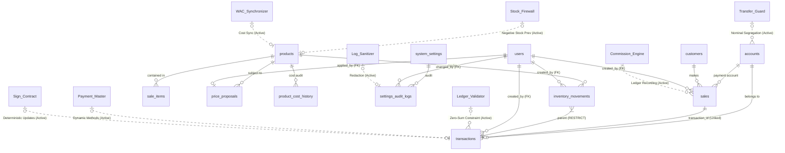

# ERD: Global System Strategy

Este diagrama representa la visión macro del sistema ERP, conectando los módulos de inventario, finanzas, clientes y configuración.

## Estrategia Financiera

El sistema utiliza un **Ledger de Partida Doble** con validación estricta de suma cero. La lógica de actualización de saldos es **determinista** basada en el tipo de transacción (`INCOME` siempre suma, `EXPENSE` siempre resta), independientemente del signo del monto ingresado.

