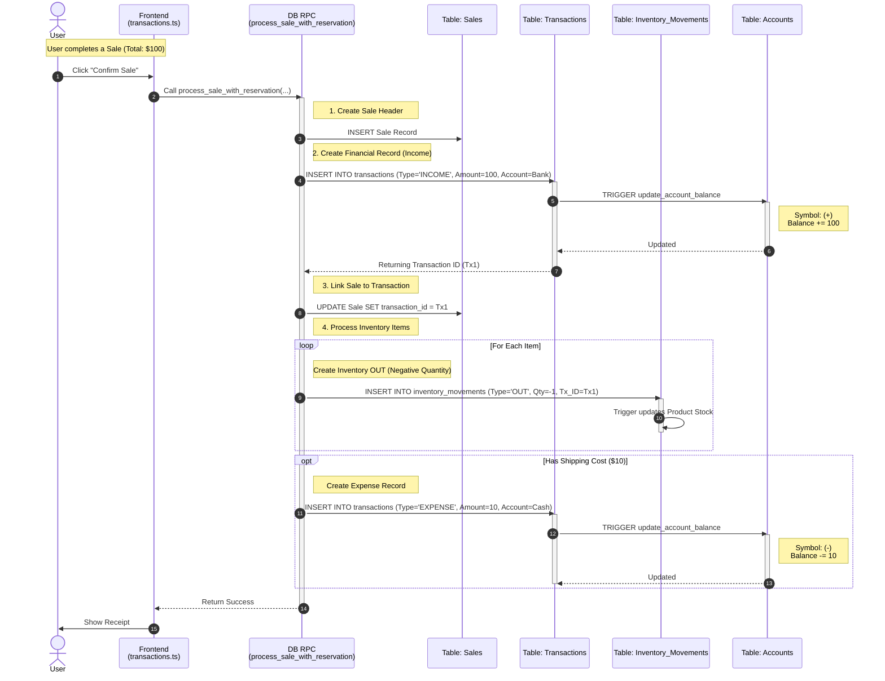
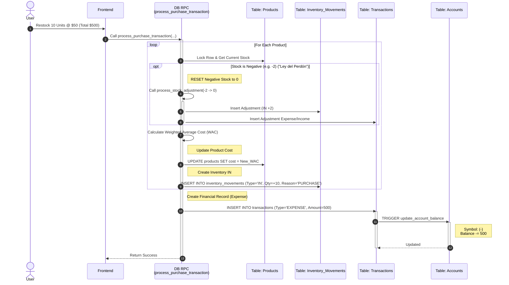
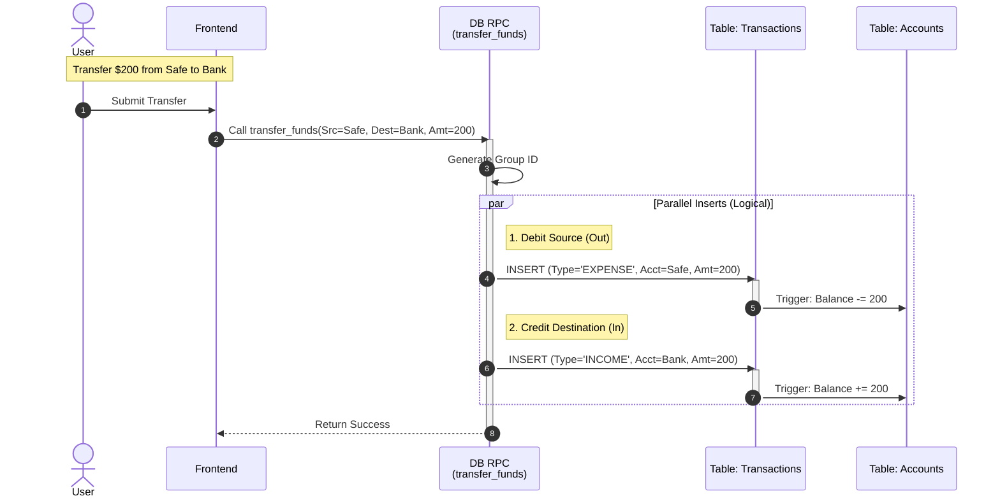
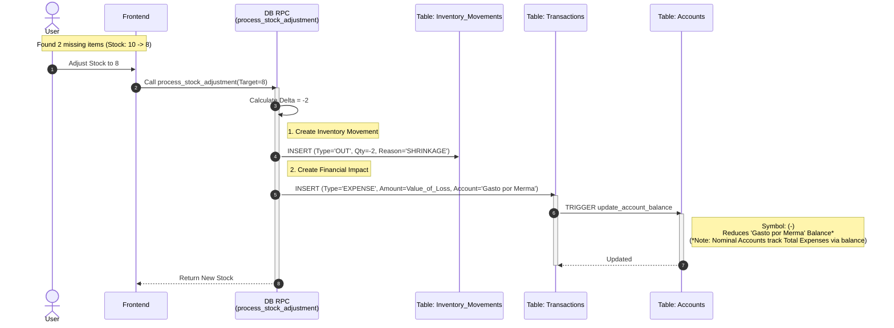

# Transaction System Analysis: Data & Symbol Flow

This document details the flow of data and "symbols" (Positive/Negative financial effects) across the system's core transaction types.

## Core Financial Principles

The system uses a **Type-Based** logic for updating account balances, rather than relying solely on the sign of the input amount.

### Symbol Logic (Balance Updates)
The `update_account_balance` trigger (defined in `20260215_fix_balance_signs.sql`) enforces the following rules:

| Transaction Type | Effect on Balance | Formula | Logic |
| :--- | :--- | :--- | :--- |
| **INCOME** | **(+) Increase** | `Balance = Balance + ABS(Amount)` | Money entering an account (e.g., Sales). |
| **EXPENSE** | **(-) Decrease** | `Balance = Balance - ABS(Amount)` | Money leaving an account (e.g., Purchases, Costs). |
| **PURCHASE** | **(-) Decrease** | `Balance = Balance - ABS(Amount)` | Treated same as Expense (Inventory buying). |
| **TRANSFER** | **(+/-) Move** | *Source*: `Balance - ABS(Amount)` *Dest*: `Balance + ABS(Amount)` | Money moving between internal accounts. |

---

## 1. Sale Transaction Flow
**Focus**: Revenue Generation, Inventory Reduction, and Optional Costs.

This flow is orchestrated by the `process_sale_with_reservation` RPC. It links the Financial Transaction directly to the Sale Header and Inventory Movements.

---

## 2. Purchase (Restock) Flow
**Focus**: Money Out, Inventory In, WAC Calculation, and "Ley del Perdón".

Orchestrated by `process_purchase_transaction` (Atomic RPC).

---

## 3. Transfer Flow (Dual Entry)
**Focus**: Moving money between accounts with strict separation.

Implements a **Dual-Entry** pattern where two transaction rows are created to represent the flow, ensuring auditability of both sides.

---

## 4. Inventory Adjustment (Shrinkage) Flow
**Focus**: Correcting stock discrepancies and recording the financial loss.

