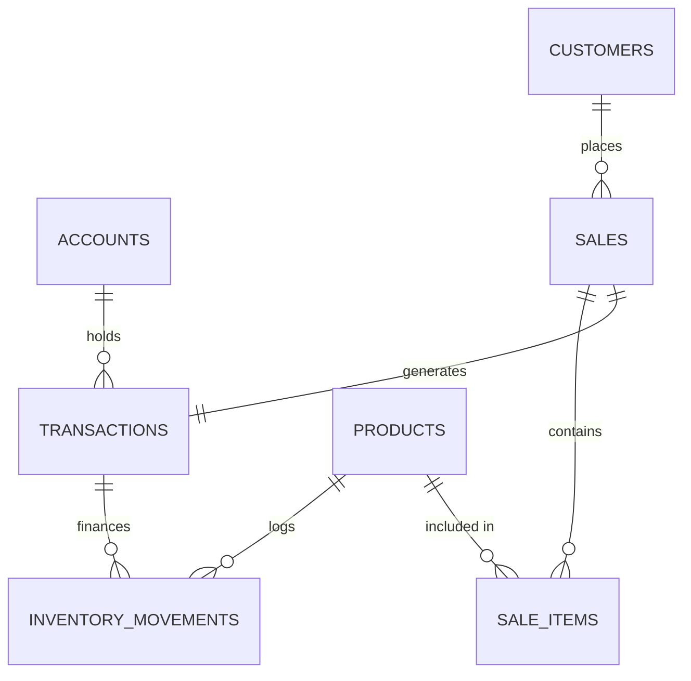

# Schema Map

## Core Tables

| Table | Description | Primary Key | Key Relationships |
|-------|-------------|-------------|-------------------|
| `accounts` | Financial accounts (Cash, Bank, etc.) | `id` | `transactions.account_id` |
| `products` | Inventory master data | `id` | `inventory_movements.product_id`, `sale_items.product_id` |
| `customers` | Customer information | `id` | `sales.customer_id` |
| `transactions`| Financial ledger entries | `id` | `accounts.id`, `inventory_movements.transaction_id` |
| `inventory_movements` | Stock ledger entries | `id` | `products.id`, `transactions.id` |
| `sales` | Sale header records | `id` | `customers.id`, `accounts.id`, `sale_items.sale_id` |
| `sale_items` | Sale line items | `id` | `sales.id`, `products.id` |

## Relationship Diagram (Conceptual)

## Key Constraints
- **Double-Entry**: Enforced by `group_id` balance checks.
- **Positive Stock**: `products.current_stock >= 0` (with exceptions handled by [[WAC_Governance]]).
- **Immutable Ledger**: Deletions are restricted or handled via triggers to maintain integrity.
