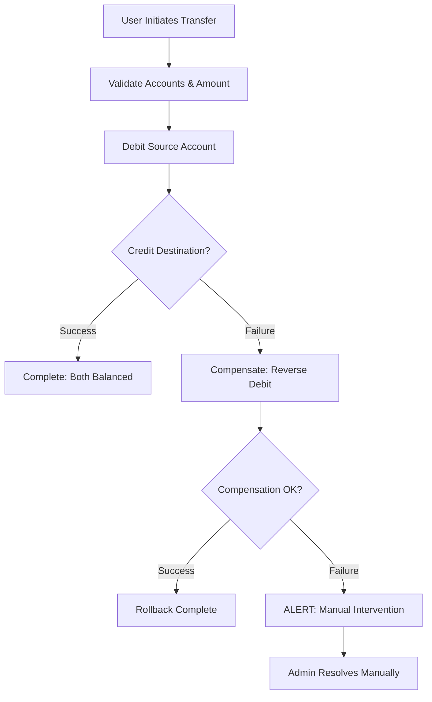

# Transfer Saga Pattern

## Description
The **Transfer Saga Pattern** describes the full workflow for moving funds between accounts, including error handling and compensation procedures. This pattern ensures data consistency even in the face of partial failures.

> [!NOTE]
> **BPMN Reference**: Formally modeled in [[Financial_Management_Process.bpmn]] → Transfer Flow.

## Hierarchy
- **Parent**: [[Financial_Laws]]
- **Siblings**: [[Transaction_Workflows]]

## The Saga Flow



## BPMN Activity Mapping

| BPMN Activity ID | Name | Description |
|------------------|------|-------------|
| `Activity_InitiateTransfer` | Initiate Transfer | User enters amount, source, and destination accounts |
| `Activity_TransferSourceDebit` | Debit Source | Subtract amount from source account (first ledger entry) |
| `Activity_TransferDestCredit` | Credit Destination | Add amount to destination account (second ledger entry) |
| `BoundaryEvent_TransferFail` | Transfer Failed | Catches failure on credit leg |
| `Activity_CompensateTransfer` | Compensate Transfer | Reverses the debit if credit fails |
| `BoundaryEvent_CompensateFail` | Compensation Failed | Catches failure on compensation attempt |
| `Activity_ManualIntervention` | Manual Intervention | Admin must reconcile accounts manually |

## Error Codes

| Code | Trigger | Action |
|------|---------|--------|
| `ERR_TRANSFER_001` | Credit leg failed | Trigger compensation |
| `ERR_COMPENSATE_001` | Compensation failed | Escalate to admin |

## PostgreSQL Implementation

In practice, PostgreSQL's ACID transactions provide automatic saga compensation:

```sql
-- transfer_funds RPC (simplified)
BEGIN;
  -- Step 1: Debit Source (INSERT negative amount)
  INSERT INTO transactions (..., amount = -100, account_id = source);
  
  -- Step 2: Credit Destination (Trigger auto-generates via auto_balance_transaction_trigger)
  -- If anything fails here, the entire transaction rolls back automatically.
COMMIT;
```

> [!IMPORTANT]
> The Saga Pattern is modeled in BPMN for **documentation and process understanding**. PostgreSQL's transactional guarantees ensure that explicit compensation code is unnecessary—the database handles rollback automatically.

## When Manual Intervention is Needed

Manual intervention would only be required in scenarios outside database control:
- External payment gateway timeout
- Network failure after partial commit to external system
- Cross-database distributed transaction failure

For the current system (single PostgreSQL database), manual intervention paths are theoretical safeguards.

## Related Documentation
- [[Financial_Laws]] - Governing principles
- [[Transaction_Workflows]] - Step-by-step RPC specifications
- [[General_Ledger]] - Immutable ledger rules
