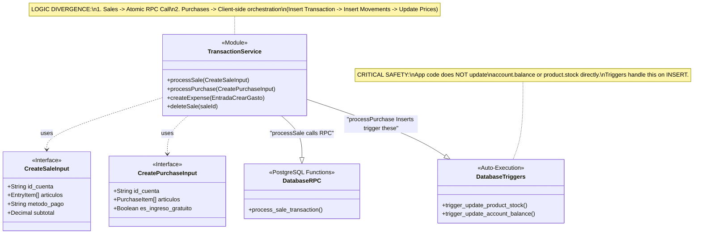

```mermaid
classDiagram
    direction TB

    %% 1. The Passive Data Interfaces (types/index.ts)
    class CreateSaleInput {
        <<Interface>>
        +String id_cuenta
        +EntryItem[] articulos
        +String metodo_pago
        +Decimal subtotal
    }

    class CreatePurchaseInput {
        <<Interface>>
        +String id_cuenta
        +PurchaseItem[] articulos
        +Boolean es_ingreso_gratuito
    }

    %% 2. The Active Service Layer (lib/services/transactions.ts)
    class TransactionService {
        <<Module>>
        +processSale(CreateSaleInput)
        +processPurchase(CreatePurchaseInput)
        +createExpense(EntradaCrearGasto)
        +deleteSale(saleId)
    }

    %% 3. The Database Execution Layer (Supabase)
    class DatabaseRPC {
        <<PostgreSQL Functions>>
        +process_sale_transaction()
    }

    class DatabaseTriggers {
        <<Auto-Execution>>
        +trigger_update_product_stock()
        +trigger_update_account_balance()
    }

    %% Relationships
    TransactionService ..> CreateSaleInput : uses
    TransactionService ..> CreatePurchaseInput : uses
    
    %% Execution Flow Logic
    TransactionService --|> DatabaseRPC : "processSale calls RPC"
    TransactionService --|> DatabaseTriggers : "processPurchase Inserts trigger these"

    note for TransactionService "LOGIC DIVERGENCE:\n1. Sales -> Atomic RPC Call\n2. Purchases -> Client-side orchestration\n(Insert Transaction -> Insert Movements -> Update Prices)"
    
    note for DatabaseTriggers "CRITICAL SAFETY:\nApp code does NOT update\naccount.balance or product.stock directly.\nTriggers handle this on INSERT."
```