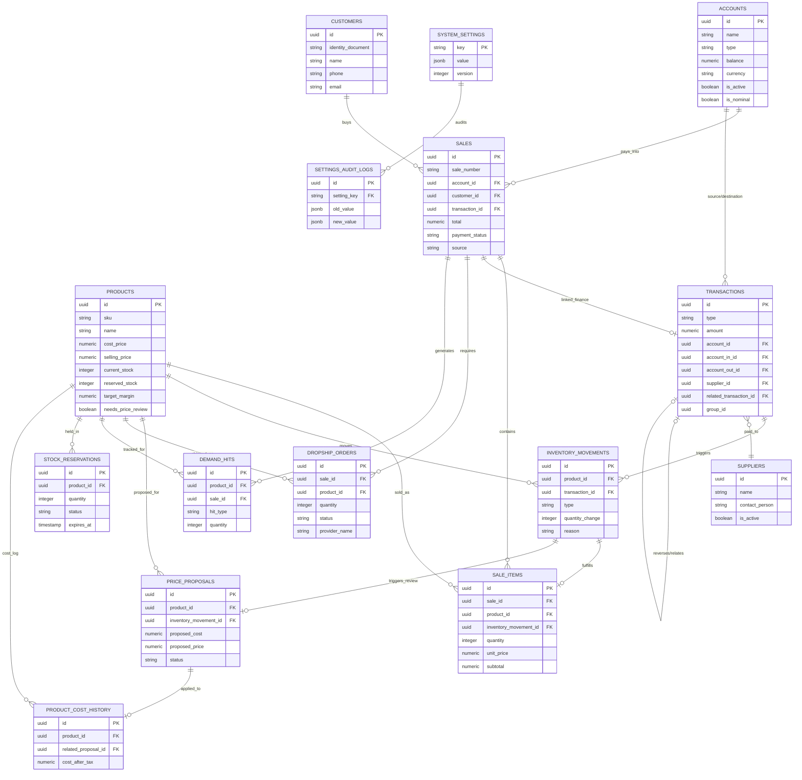
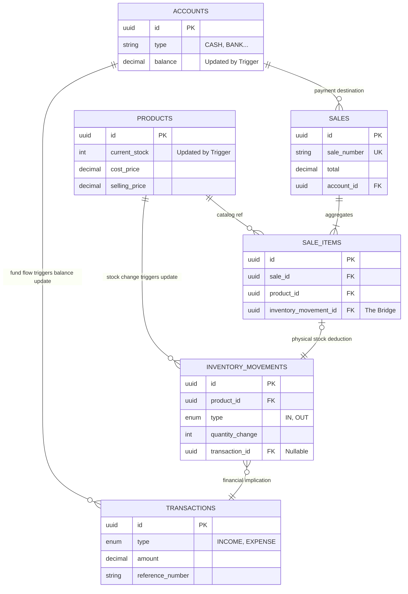

# Comprehensive Database Schema ERD

Este diagrama detalla todas las tablas y relaciones del sistema basadas en el esquema SQL actual, incluyendo los módulos de inventario, finanzas, ventas, proveedores y configuración.

