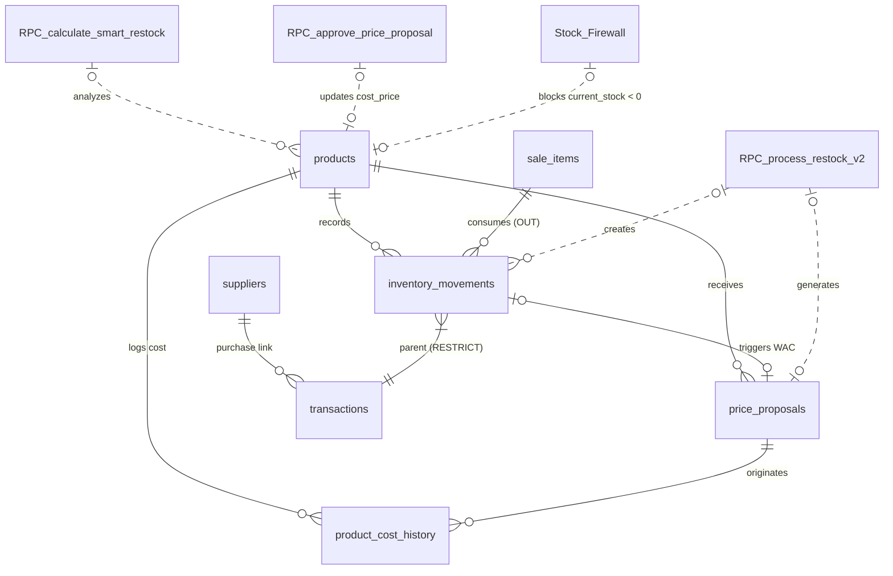

# ERD: Inventory Flow & Restock

Diagrama enfocado en el ciclo de vida del producto: desde la llegada vía proveedor hasta la venta y el ajuste de stock.

```mermaid
erDiagram
    products ||--o{ inventory_movements : "records"
    products ||--o{ price_proposals : "receives"
    products ||--o{ product_cost_history : "logs cost"
    
    suppliers ||--o{ transactions : "purchase link"
    
    inventory_movements }|--|| transactions : "parent (RESTRICT)"
    inventory_movements |o--o| price_proposals : "triggers WAC"
    
    price_proposals ||--o{ product_cost_history : "originates"
    
    sale_items ||--o{ inventory_movements : "consumes (OUT)"

    %% Critical Logic Flow
    RPC_calculate_smart_restock |o..o{ products : "analyzes"
    RPC_process_restock_v2 |o..o{ inventory_movements : "creates"
    RPC_process_restock_v2 |o..o| price_proposals : "generates"
    
    %% Phase 3 Hardening
    RPC_approve_price_proposal |o..o| products : "updates cost_price "
    Stock_Firewall |o..o| products : "blocks current_stock < 0"
```

