# Product Form ERD Diagram

## Overview
This ERD diagram illustrates the database schema related to the Product Form, showing how form fields map to database tables and their relationships.

## Entity Relationship Diagram

```mermaid
erDiagram
    PRODUCTS ||--o{ INVENTORY_MOVEMENTS : "has"
    PRODUCTS {
        uuid id PK "Primary Key"
        varchar sku UK "Unique, Required (Form: SKU)"
        varchar name "Required (Form: Nombre del Producto)"
        text description "Optional (Form: Descripción)"
        varchar category "Optional (Form: Categoría)"
        varchar brand "Optional (Form: Marca)"
        decimal cost_price "Required, ≥0 (Form: Costo)"
        decimal selling_price "Required, ≥0 (Form: Precio Venta)"
        decimal target_margin "Optional, 0-0.99 (Form: Margen Objetivo %)"
        integer current_stock "Calculated from movements, NOT from form"
        integer min_stock_level "Required, ≥0, Default: 5 (Form: Min)"
        integer max_stock_level "Required, ≥0, Default: 100 (Form: Max)"
        text image_url "Optional, Valid URL (Form: URL Imagen)"
        text[] additional_images "Optional"
        boolean is_active "Default: true"
        timestamptz created_at "Auto-generated"
        timestamptz updated_at "Auto-generated"
    }

    INVENTORY_MOVEMENTS {
        uuid id PK "Primary Key"
        uuid product_id FK "References products(id)"
        varchar type "IN, OUT, ADJUSTMENT"
        integer quantity_change "Signed integer"
        decimal unit_price "Price at movement time"
        decimal total_value "quantity_change * unit_price"
        uuid transaction_id FK "Optional, references transactions"
        varchar reason "OPENING_BALANCE, PURCHASE, SALE, etc."
        text notes "Movement description"
        timestamptz movement_date "Auto-generated"
        timestamptz created_at "Auto-generated"
        uuid created_by FK "References auth.users"
        varchar created_by_name "User name snapshot"
    }

    INVENTORY_MOVEMENTS ||--o| TRANSACTIONS : "may link to"
    TRANSACTIONS {
        uuid id PK "Primary Key"
        varchar type "INCOME, EXPENSE"
        decimal amount "Transaction amount"
        text description "Transaction description"
        uuid account_id FK "Required, references accounts"
        uuid account_in_id FK "Optional, for double-entry"
        uuid account_out_id FK "Optional, for double-entry"
        uuid group_id "Groups related transactions"
        varchar payment_method "CASH, CARD, TRANSFER, etc."
        varchar reference_number "Invoice/receipt number"
        timestamptz transaction_date "Auto-generated"
        timestamptz created_at "Auto-generated"
        uuid created_by FK "References auth.users"
        varchar created_by_name "User name snapshot"
        text notes "Additional notes"
        boolean is_reversed "Default: false"
        uuid related_transaction_id FK "For reversals"
        boolean is_manual_adjustment "Default: false"
    }

    TRANSACTIONS }o--|| ACCOUNTS : "debits/credits"
    ACCOUNTS {
        uuid id PK "Primary Key"
        varchar name "Account name"
        varchar type "CASH, BANK, DIGITAL_WALLET, ASSET, INCOME, EXPENSE"
        decimal balance "Current balance"
        varchar currency "Default: USD"
        boolean is_active "Default: true"
        boolean is_nominal "True for non-cash accounts"
        timestamptz created_at "Auto-generated"
        timestamptz updated_at "Auto-generated"
    }

    PRODUCTS ||--o{ SALE_ITEMS : "sold in"
    SALE_ITEMS {
        uuid id PK "Primary Key"
        uuid sale_id FK "References sales(id)"
        uuid product_id FK "References products(id)"
        integer quantity "Quantity sold"
        decimal unit_price "Price at sale time"
        decimal discount "Item discount"
        decimal subtotal "Calculated total"
        uuid inventory_movement_id FK "Links to movement"
    }

    SALE_ITEMS }o--|| SALES : "belongs to"
    SALES {
        uuid id PK "Primary Key"
        varchar sale_number UK "Unique sale identifier"
        uuid customer_id FK "Optional, references customers"
        varchar customer_name "Customer name snapshot"
        varchar customer_phone "Customer phone snapshot"
        varchar customer_email "Customer email snapshot"
        decimal subtotal "Sale subtotal"
        decimal tax "Tax amount"
        decimal discount "Total discount"
        decimal total "Final total"
        uuid account_id FK "Payment account"
        varchar payment_status "PAID, PENDING, REVERSED, etc."
        varchar source "POS, WHATSAPP, NOTION, etc."
        text delivery_proof_url "Optional"
        timestamptz sale_date "Auto-generated"
        timestamptz created_at "Auto-generated"
        text notes "Sale notes"
    }

    SALES }o--o| CUSTOMERS : "may have"
    CUSTOMERS {
        uuid id PK "Primary Key"
        varchar identity_document UK "Cedula/RUC/Passport"
        varchar name "Customer name"
        varchar phone "Contact phone"
        varchar email "Contact email"
        varchar city "City"
        text address "Full address"
        timestamptz created_at "Auto-generated"
        timestamptz updated_at "Auto-generated"
    }
```



## Form Field Mapping

### Direct Mappings (Form → Database)
| Form Field | Database Column | Table | Validation |
|------------|----------------|-------|------------|
| SKU | `sku` | products | Required, min 1 char, unique |
| Nombre del Producto | `name` | products | Required, min 1 char |
| Marca | `brand` | products | Optional |
| Categoría | `category` | products | Optional |
| Costo | `cost_price` | products | Required, ≥ 0 |
| Margen Objetivo (%) | `target_margin` | products | Optional, 0-99%, stored as decimal (30% → 0.30) |
| Precio Venta | `selling_price` | products | Required, ≥ 0, rounded up (Math.ceil) |
| Stock | `current_stock` | products | **NOT directly set**, calculated from movements |
| Min | `min_stock_level` | products | Required, integer ≥ 0, default: 5 |
| Max | `max_stock_level` | products | Required, integer ≥ 0, default: 100 |
| URL Imagen | `image_url` | products | Optional, must be valid URL or empty string |
| Descripción | `description` | products | Optional, text area |

### Indirect Mappings (Form → Process → Database)
| Form Field | Process | Result |
|------------|---------|--------|
| Stock (when > 0) | Creates `inventory_movements` record | Updates `products.current_stock` via trigger |
| Stock (when > 0) | Creates opening equity transaction | Inserts into `transactions` and `accounts` |
| Margen Objetivo | Converted from percentage to decimal | 30 → 0.30 before storage |
| Precio Venta | Rounded to ceiling | 15.3 → 16 |

## Validation Rules Summary

### Required Fields (Cannot be empty)
- ✅ SKU
- ✅ Nombre del Producto
- ✅ Costo (must be ≥ 0)
- ✅ Precio Venta (must be ≥ 0)
- ✅ Stock (must be integer ≥ 0)
- ✅ Min Stock (must be integer ≥ 0)
- ✅ Max Stock (must be integer ≥ 0)

### Optional Fields
- Marca (Brand)
- Categoría (Category)
- Margen Objetivo (0-99%)
- URL Imagen (must be valid URL if provided)
- Descripción (Description)

### Rejection Conditions
| Field | Rejection Condition | Error Message |
|-------|-------------------|---------------|
| SKU | Empty or missing | "El SKU es requerido" |
| Name | Empty or missing | "El nombre es requerido" |
| Cost Price | < 0 | "El costo debe ser mayor o igual a 0" |
| Selling Price | < 0 | "El precio debe ser mayor o igual a 0" |
| Target Margin | < 0 or > 99 | "El margen no puede superar el 99%" |
| Current Stock | < 0 or non-integer | "El stock debe ser mayor o igual a 0" |
| Min Stock | < 0 or non-integer | "El stock mínimo debe ser mayor o igual a 0" |
| Max Stock | < 0 or non-integer | "El stock máximo debe ser mayor o igual a 0" |
| Image URL | Invalid URL format | "URL inválida" |

## Ledger-First Architecture Notes

### Critical: Stock is NEVER Set Directly
When creating a product with initial stock:

1. **Product Record Created** with `current_stock = 0`
2. **Inventory Movement Created** with:
   - `type = 'IN'`
   - `reason = 'OPENING_BALANCE'`
   - `quantity_change = <form stock value>`
3. **Trigger Fires** (`trigger_update_product_stock`) to update `products.current_stock`
4. **Opening Equity Recorded** (if stock > 0):
   - Debit: Inventory Asset Account
   - Credit: Opening Balance Equity Account

This ensures:
- ✅ Complete audit trail
- ✅ Accurate WAC (Weighted Average Cost) calculation
- ✅ Financial integrity (assets = liabilities + equity)
- ✅ No direct stock manipulation

## Related Tables (Not in Form)

### Supporting Tables
- **auth.users**: User authentication and authorization
- **admins**: Admin user details
- **price_proposals**: Price change approval workflow
- **demand_hits**: Product demand tracking
- **stock_reservations**: Temporary stock holds during sales
- **dropship_orders**: Drop shipping orders
- **commission_rules**: Sales commission configuration
- **commission_ledger**: Commission calculations

## Constraints and Indexes

### Unique Constraints
- `products.sku` - Ensures no duplicate product codes
- `sales.sale_number` - Ensures unique sale identifiers
- `customers.identity_document` - Ensures unique customer IDs

### Foreign Key Constraints
- `inventory_movements.product_id` → `products.id` (ON DELETE RESTRICT)
- `inventory_movements.transaction_id` → `transactions.id` (ON DELETE RESTRICT)
- `transactions.account_id` → `accounts.id` (ON DELETE RESTRICT)
- `sale_items.product_id` → `products.id` (ON DELETE RESTRICT)
- `sale_items.sale_id` → `sales.id` (ON DELETE CASCADE)

### Check Constraints
- `products.cost_price >= 0`
- `products.selling_price >= 0`
- `products.current_stock >= 0`
- `accounts.type IN ('CASH', 'BANK', 'DIGITAL_WALLET', 'ASSET', 'INCOME', 'EXPENSE')`
- `inventory_movements.type IN ('IN', 'OUT', 'ADJUSTMENT')`
- `inventory_movements.reason IN ('SALE', 'PURCHASE', 'RETURN', 'DAMAGE', 'THEFT', 'COUNT_ADJUSTMENT', 'SHRINKAGE', 'OTHER', 'OPENING_BALANCE')`

## Triggers

### Automatic Stock Updates
- **trigger_update_product_stock**: Fires AFTER INSERT, UPDATE, DELETE on `inventory_movements`
  - Adjusts `products.current_stock` based on `quantity_change`
  - Ensures stock is always in sync with movement ledger

### Automatic Balance Updates
- **trigger_update_account_balance**: Fires AFTER INSERT, DELETE on `transactions`
  - Adjusts `accounts.balance` based on transaction type (INCOME/EXPENSE)
  - Ensures account balances are always accurate

### Timestamp Updates
- **update_updated_at_column**: Fires BEFORE UPDATE on `products`, `accounts`, `customers`
  - Automatically updates `updated_at` timestamp

## Data Flow: Form Submission → Database

```
User Fills Form
    ↓
Frontend Validation (Zod Schema)
    ↓
[PASS] → Process Data (convert margin %, round price)
    ↓
Call create_product_v2 RPC
    ↓
Backend: Insert into products (current_stock = 0)
    ↓
[IF stock > 0] → Create inventory_movement (type='IN', reason='OPENING_BALANCE')
    ↓
Trigger: Update products.current_stock
    ↓
[IF stock > 0] → Create opening equity transaction
    ↓
Success: Product Created
```

---

**Last Updated**: 2026-02-12  
**Version**: 1.0  
**Related BPMN**: `Product_Form_Validation.bpmn`, `Product_Management_Process.bpmn`
