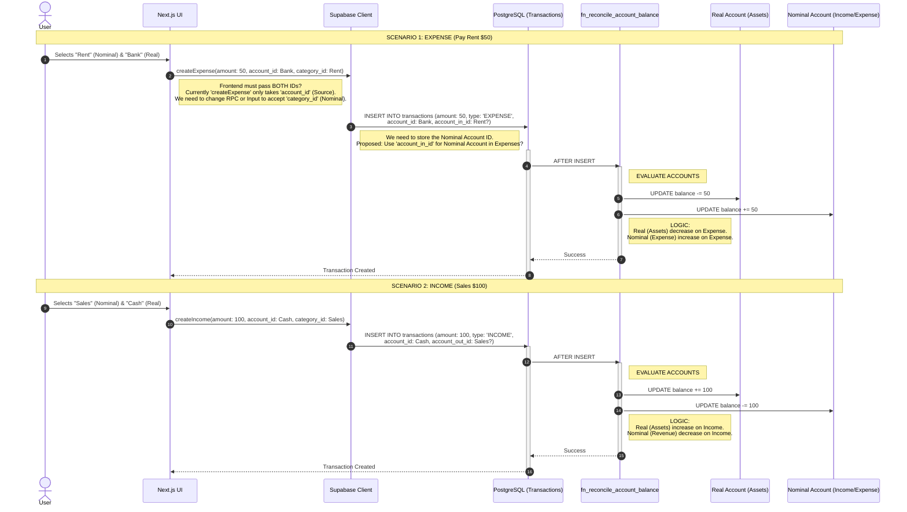
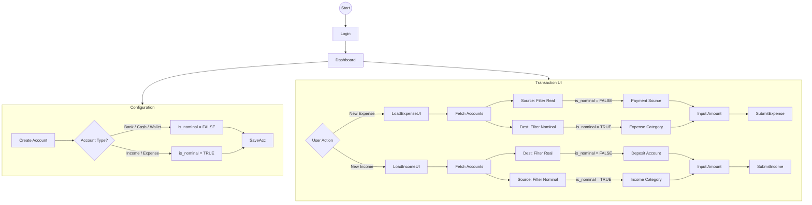
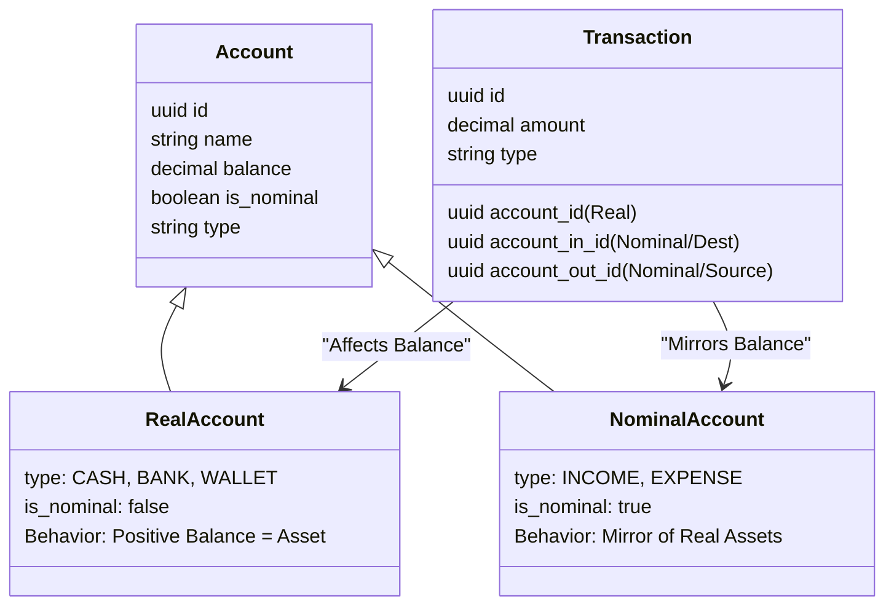

# Nominal Accounts Architecture

## 1. Sequence Diagram: Mirror Logic
This diagram details the flow of transactions and how the "Mirror" logic is applied via the PostgreSQL Trigger.

## 2. BPMN Diagram: Nominal Category Management
This process map shows how Nominal Accounts are managed and filtered in the UI.

## 3. Updated System Map
Visualizing the relationship between Real and Nominal accounts.

