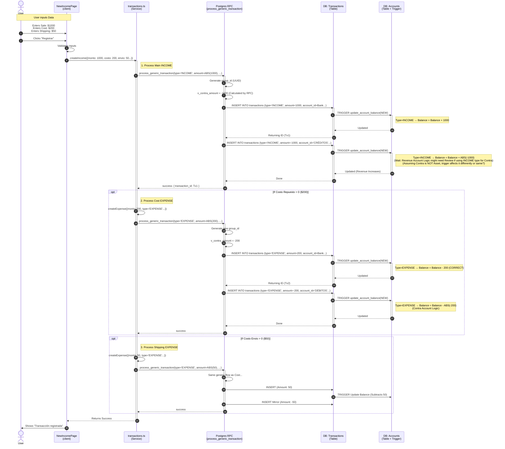

# Sequence Diagram: Income Transaction Flow (Corrected)

This diagram illustrates the flow of creating an Income transaction with associated costs (e.g. Sales with optional Cost of Goods and Shipping), from the Frontend UI down to the Database Triggers.

## Flow Overview

1.  **Frontend**: User inputs positive values for Sale, Cost, and Shipping.
2.  **Service**: Orchestrates calls. First creates the Income, then optionally creates Expenses for costs.
3.  **RPC**: `process_generic_transaction` handles the Double-Entry logic (creating a Mirror/Contra transaction).
4.  **Database**: Triggers update account balances based on **TYPE**, not Input Sign. 
    *   **INCOME**: `Balance = Balance + ABS(Amount)`
    *   **EXPENSE**: `Balance = Balance - ABS(Amount)`

