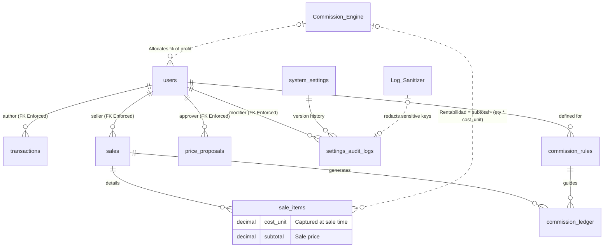

# ERD: Commissions & Audit Tracking

Diagrama sobre la trazabilidad de usuarios, auditoría de configuración y cálculos de rentabilidad/comisiones.

```mermaid
erDiagram
    users ||--o{ transactions : "author (FK Enforced)"
    users ||--o{ sales : "seller (FK Enforced)"
    users ||--o{ price_proposals : "approver (FK Enforced)"
    users ||--o{ settings_audit_logs : "modifier (FK Enforced)"
    
    sales ||--o{ sale_items : "details"
    sale_items {
        decimal cost_unit "Captured at sale time"
        decimal subtotal "Sale price"
    }
    
    %% Virtual Commission Logic
    Commission_Engine |o..o{ sale_items : "Rentabilidad = subtotal - (qty * cost_unit)"
    Commission_Engine |o..o{ users : "Allocates % of profit"
    
    system_settings ||--o{ settings_audit_logs : "version history"
    
    %% Phase 4 Additions
    users ||--o{ commission_rules : "defined for"
    sales ||--o{ commission_ledger : "generates"
    commission_rules ||--o{ commission_ledger : "guides"
    
    Log_Sanitizer |o..o| settings_audit_logs : "redacts sensitive keys"
```

