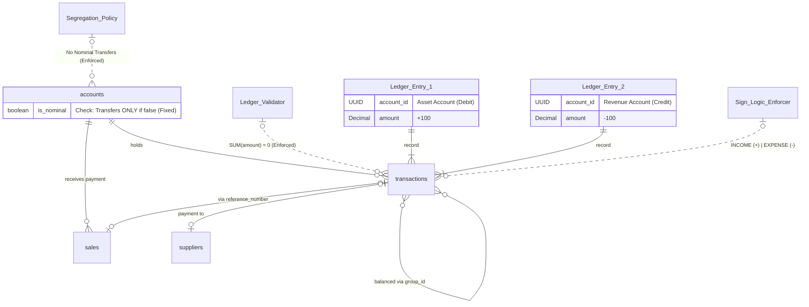

# ERD: Financial Flow (Ledger)

Diagrama sobre el movimiento de efectivo, cuentas nominales de ingreso/gasto y la arquitectura de partida doble.

## Contrato de Signos (Sign Logic Contract)

**Determinismo basado en Tipo (Type-Based Determinism):**
El sistema ignora el signo del `amount` ingresado y aplica la lógica según el tipo de transacción para las cuentas de Activo (Asset Accounts).

| Tipo Transacción | Lógica de Balance | Significado |
| :--- | :--- | :--- |
| **INCOME** | `Balance = Balance + ABS(amount)` | Entrada de Dinero (Aumenta Activo) |
| **EXPENSE** | `Balance = Balance - ABS(amount)` | Salida de Dinero (Disminuye Activo) |
| **TRANSFER** | `Out: Balance - ABS(amount)`   `In: Balance + ABS(amount)` | Movimiento entre Activos |

