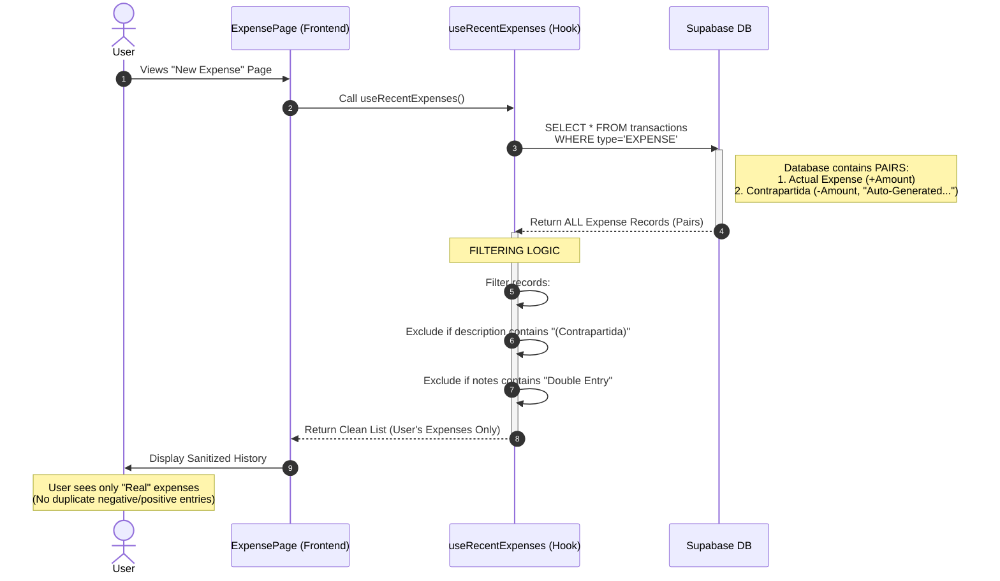

# Frontend Transaction Filtering Logic

## Overview
This diagram illustrates how the frontend fetches transactions and filters out the system-generated "Contrapartida" (Double Entry) records to show a clean history to the user, while maintaining the accounting integrity in the backend.

