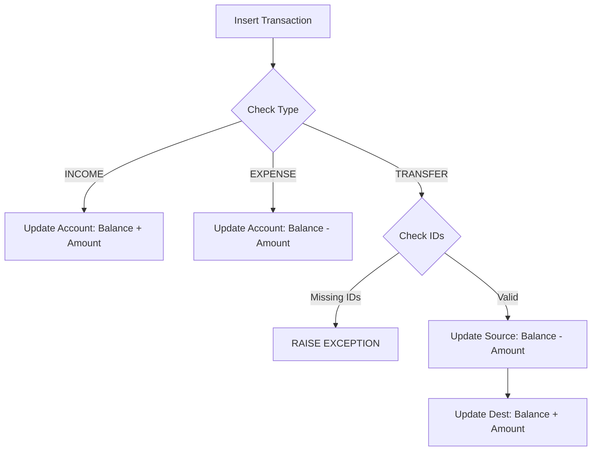
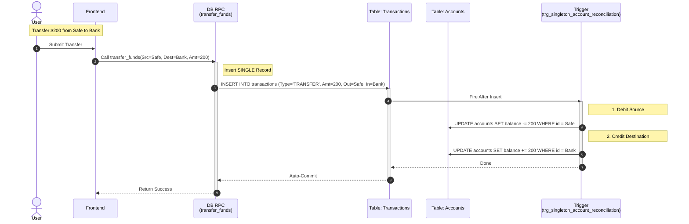
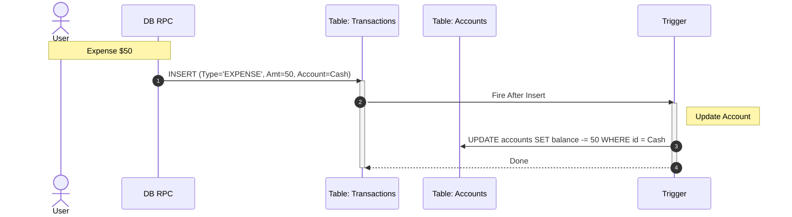

# Proposed Unified Transaction Architecture

This document outlines the **Future State** of the transaction system, designed to eliminate "Double Counting" and simplify the Transfer model.

## Key Architectural Changes

1.  **Single Source of Truth (Trigger)**: All balance updates are handled by **ONE** trigger (`trg_singleton_account_reconciliation`).
2.  **Single-Record Transfer**: Transfers are now recorded as a single row in `transactions` with both `account_out_id` and `account_in_id` set. The logic does NOT create two separate rows.
3.  **Strict Reconciliation**: The trigger enforces logic based strictly on `type` and `account_..._id` fields.

---

## 1. Unified Trigger Logic (`trg_singleton_account_reconciliation`)
**Logic**: Auto-reconcile balances based on Transaction Type.

---

## 2. Refactored Transfer Flow
**Focus**: Efficiency and Atomic Consistency.

Instead of creating two rows (Debit + Credit), we create **one row** that represents the movement. The Trigger handles the accounting on both sides.

---

## 3. Standard Income Flow (Simplified)
**Focus**: No more duplicate/mirror rows for simple Income.

## 4. Standard Expense Flow (Simplified)
**Focus**: Direct dependency on Account ID.

