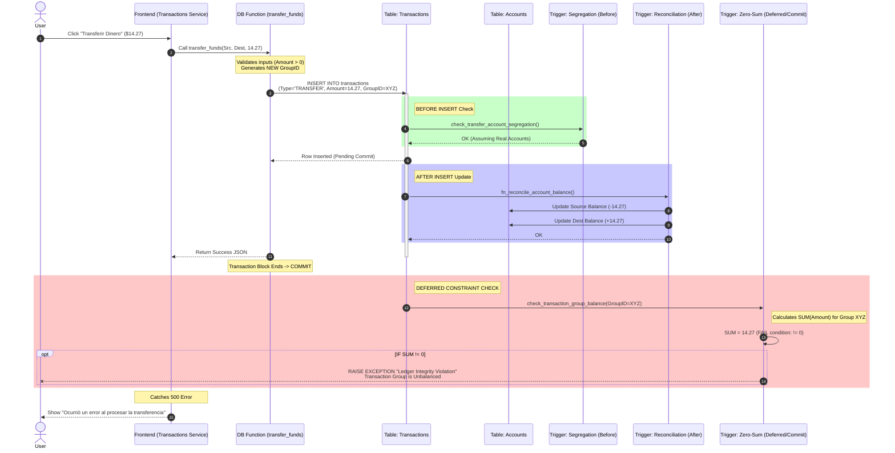
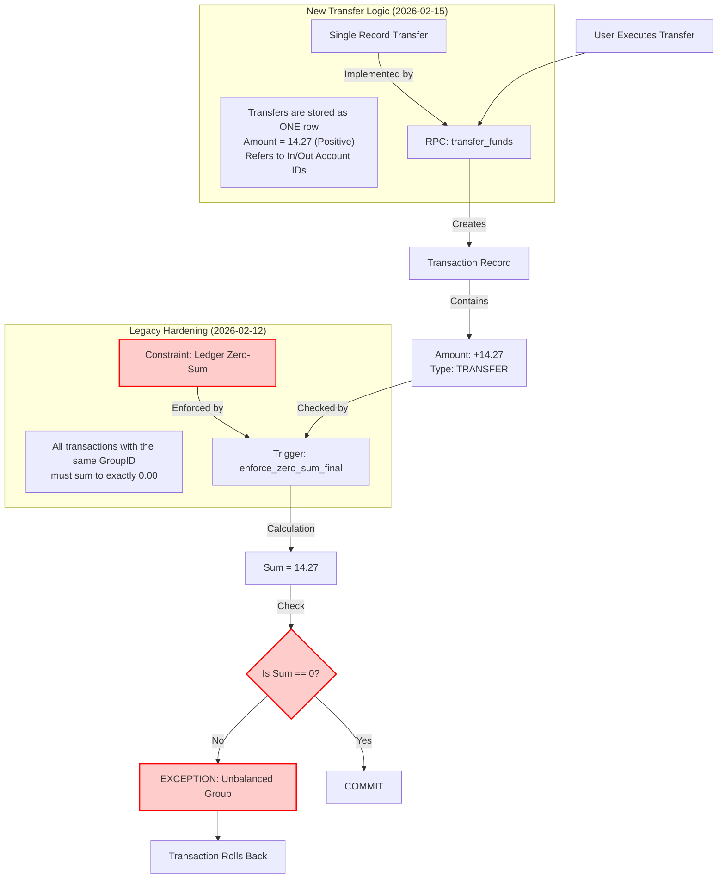
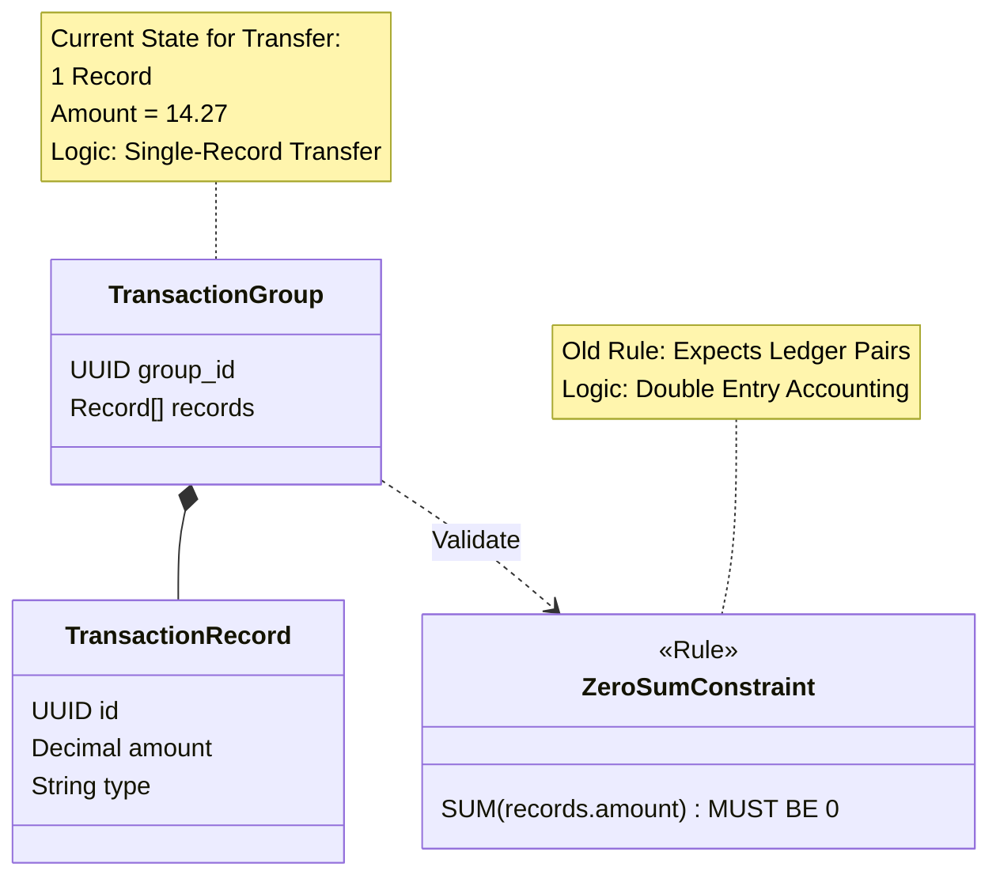

# Transfer Failure Analysis Diagrams

## 1. Sequence Diagram: The Failure Flow
This diagram shows the sequence of events when a user attempts a transfer, highlighting the conflict between the new RPC logic and the existing database constraints.

## 2. Logic Conflict Analysis
This diagram breaks down the conflicting logic rules that exist in the database.

## 3. Entity State vs Constraint
A visual representation of why the data doesn't fit the 'Box'.

